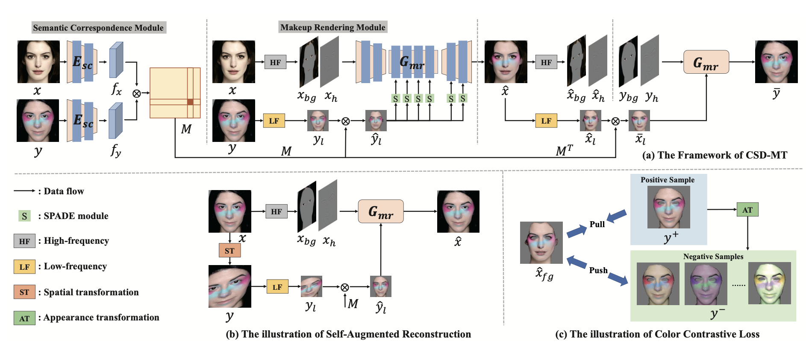
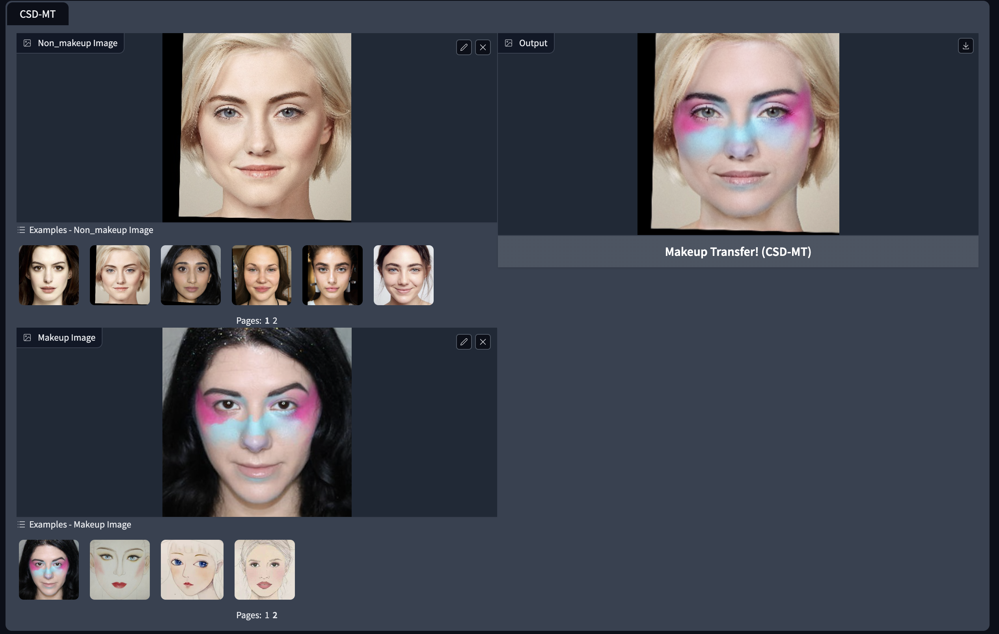
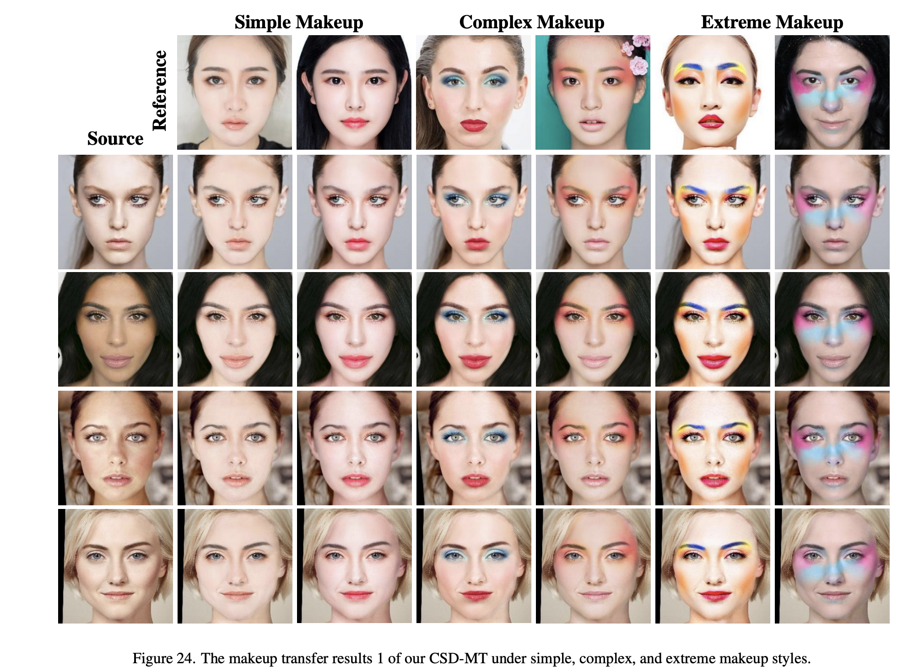
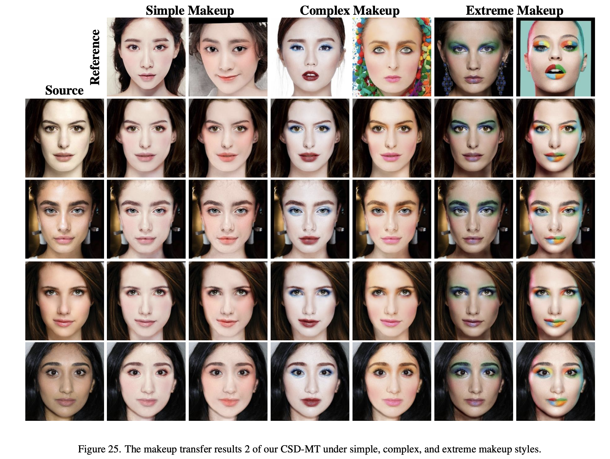

# Content-Style Decoupling for Unsupervised Makeup Transfer without Generating Pseudo Ground Truth

This is the official pytorch code for **"Content-Style Decoupling for Unsupervised Makeup Transfer without Generating Pseudo Ground Truth"**, which has been accepted by CVPR2024.

**The training code, testing code, and pre-trained model have all been open sourced**

## Author
**Zhaoyang Sun;  Shengwu Xiong; Yaxiong Chen; Yi Rong**


## News

+ Our paper SHMT was accepted by NeurIPS2024. 

+ Our paper SSAT++ was accepted by TNNLS2023. [Paper link](https://ieeexplore.ieee.org/document/10328655) and [code link](https://github.com/Snowfallingplum/SSAT_plus).

+ Our paper SSAT was accepted by AAAI2022. [Paper link](https://arxiv.org/abs/2112.03631) and [code link](https://github.com/Snowfallingplum/SSAT).

## The framework of CSD-MT




## Quick Start

If you only want to get results quickly, please go to the *"quick_start"* folder and follow the readme.md inside to download the pre trained model to generate results quickly.

We also used Gradio to generate an interactive interface for easy use.



## Requirements

We recommend that you just use your own pytorch environment; the environment needed to run our model is very simple. If you do so, please ignore the following environment creation.

A suitable [conda](https://conda.io/) environment named `CSDMT` can be created
and activated with:

```
conda env create -f environment.yaml
conda activate CSDMT
```
## Download MT dataset
1. MT dataset can be downloaded here [BeautyGAN](https://github.com/wtjiang98/BeautyGAN_pytorch). Extract the downloaded file and place it on top of this folder.
2. Prepare face parsing. Face parsing is used in this code. In our experiment, face parsing is generated by https://github.com/zllrunning/face-parsing.PyTorch.
3. Put the results of face parsing in the .\MT-Dataset\seg1\makeup and .\MT-Dataset\seg1\non-makeup

## Training code
We have set the default hyperparameters in the options.py file, please modify them yourself if necessary.
To train the model, please run the following command directly
```
python train.py
```

## Inference code

```
python inference.py
```

## Our results




## Citation

If this work is helpful for your research, please consider citing the following BibTeX entry.

```text
@inproceedings{sun2024content,
  title={Content-Style Decoupling for Unsupervised Makeup Transfer without Generating Pseudo Ground Truth},
  author={Sun, Zhaoyang and Xiong, Shengwu and Chen, Yaxiong and Rong, Yi}
  journal={Proceedings of the IEEE/CVF conference on computer vision and pattern recognition},
  year={2024}
}
```


## Acknowledgement

Some of the codes are build upon [PSGAN](https://github.com/wtjiang98/PSGAN), [Face Parsing](https://github.com/zllrunning/face-parsing.PyTorch) and [aster.Pytorch](https://github.com/ayumiymk/aster.pytorch).

## License

This work is licensed under a
[Creative Commons Attribution-NonCommercial-ShareAlike 4.0 International License][cc-by-nc-sa].

[![CC BY-NC-SA 4.0][cc-by-nc-sa-image]][cc-by-nc-sa]

[cc-by-nc-sa]: http://creativecommons.org/licenses/by-nc-sa/4.0/
[cc-by-nc-sa-image]: https://licensebuttons.net/l/by-nc-sa/4.0/88x31.png
[cc-by-nc-sa-shield]: https://img.shields.io/badge/License-CC%20BY--NC--SA%204.0-lightgrey.svg

