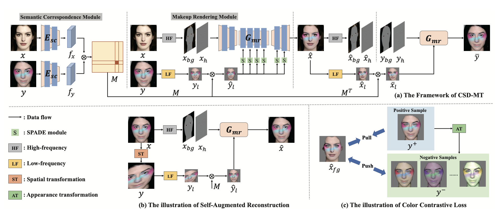
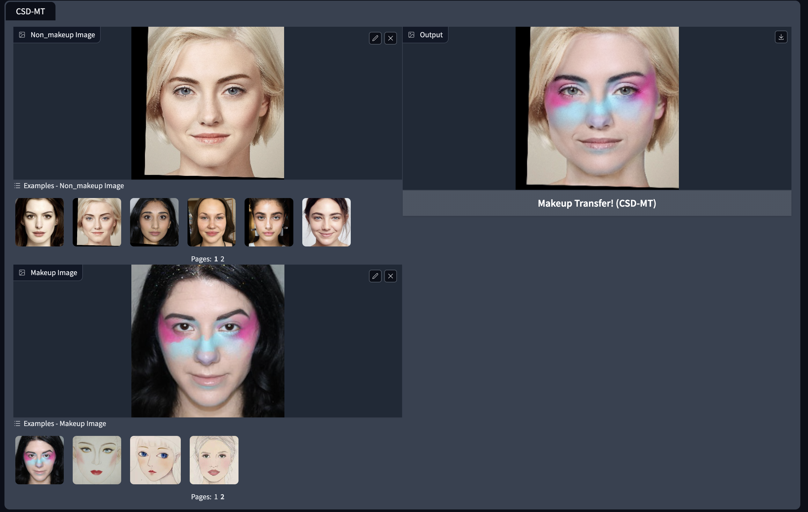

# [CVPR2024] Content-Style Decoupling for Unsupervised Makeup Transfer without Generating Pseudo Ground Truth

Zhaoyang Sun, Shegnwu Xiong, Yaxiong Chen, Yi Rong

## Paper link

https://arxiv.org/abs/2405.17240

## News 

+ Our recent paper “SHMT: Self-supervised Hierarchical Makeup Transfer via Latent Diffusion Models” has been accepted by NeurIPS 2024 and will be released later.
## Framework



## Requirements

We recommend that you just use your own pytorch environment; the environment needed to run our model is very simple. If you do so, please ignore the following environment creation.

A suitable [conda](https://conda.io/) environment named `CSDMT` can be created
and activated with:

```
conda env create -f environment.yaml
conda activate CSDMT
```

## Pretrained Models
Pre-training models can be downloaded here [Baidu Drive](https://pan.baidu.com/s/1C7K4xk5W0X65yUQh41AmfQ),password: 1d3e and [Google Drive](https://drive.google.com/drive/folders/1pvSgkpsb7k6Ph1_oCmFkMQZPgL7PaTO0?usp=drive_link)

Please put CSD_MT.pth in CSD_MT/weights/CSD_MT.pth

Put lms.dat in faceutils/dlibutils/lms.dat

Put 79999_iter.pth in facultyils/face_parsing/res/cp/79999 _iter.pth


## Run the examples

The computational complexity and computational resources required for our model are also small, and we only tested the code on CPU.
In the current directory, run the following command

```
python gradio_makeup_transfer.py
```


## How to run your own data

Just upload your own images in the above gradio screen.

## Citation

If this work is helpful for your research, please consider citing the following BibTeX entry.

```text
@inproceedings{sun2024content,
  title={Content-Style Decoupling for Unsupervised Makeup Transfer without Generating Pseudo Ground Truth},
  author={Sun, Zhaoyang and Xiong, Shengwu and Chen, Yaxiong and Rong, Yi}
  journal={Proceedings of the IEEE/CVF conference on computer vision and pattern recognition},
  year={2024}
}
```

## Acknowledgement

Some of the codes are build upon [PSGAN](https://github.com/wtjiang98/PSGAN), [Face Parsing](https://github.com/zllrunning/face-parsing.PyTorch) and [aster.Pytorch](https://github.com/ayumiymk/aster.pytorch).

## License

This work is licensed under a
[Creative Commons Attribution-NonCommercial-ShareAlike 4.0 International License][cc-by-nc-sa].

[![CC BY-NC-SA 4.0][cc-by-nc-sa-image]][cc-by-nc-sa]

[cc-by-nc-sa]: http://creativecommons.org/licenses/by-nc-sa/4.0/
[cc-by-nc-sa-image]: https://licensebuttons.net/l/by-nc-sa/4.0/88x31.png
[cc-by-nc-sa-shield]: https://img.shields.io/badge/License-CC%20BY--NC--SA%204.0-lightgrey.svg
